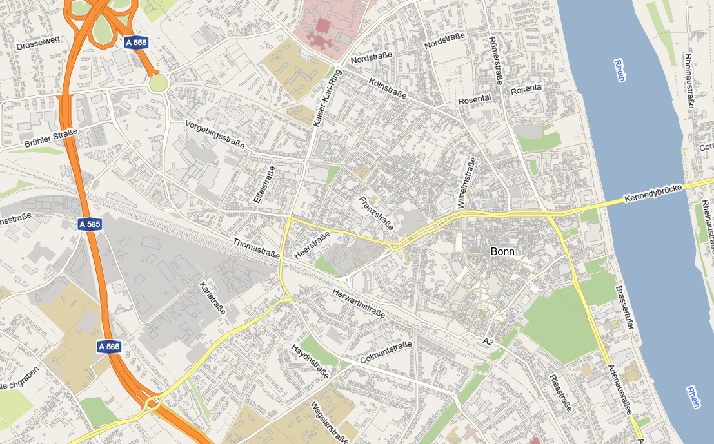

# terrestris vectortiles
A simple library that makes use of free available world-wide terrestris vectortiles in MapBox MVT format from OpenStreetMap data.

The main method `getOSMLayer` creates an openlayers VectorTile Layer, which you
can use straight in your openlayers application.



# demo
A simple demonstration application can be found here:

https://demo.terrestris.de/democlient/index.html

# how to use
Install the module e.g. by

`npm i @terrestris/vectortiles`

Then, in your code, import the main method:
```
import getOSMLayer from '@terrestris/vectortiles';
```

Then you can create the OSM-VectorTile layer by calling
```
getOSMLayer();
```
which returns the layer you can then add to your openlayers map.
